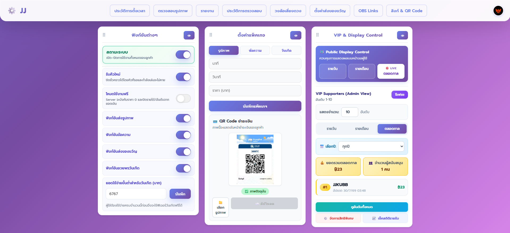
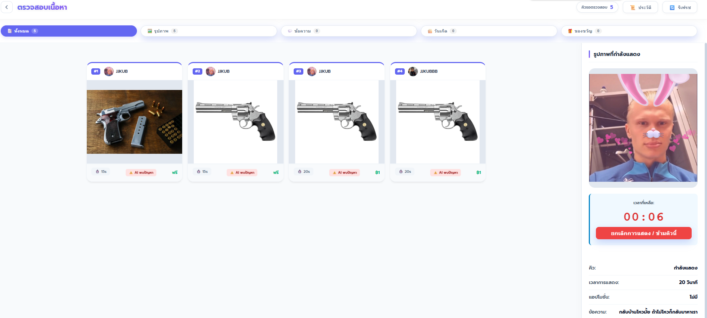
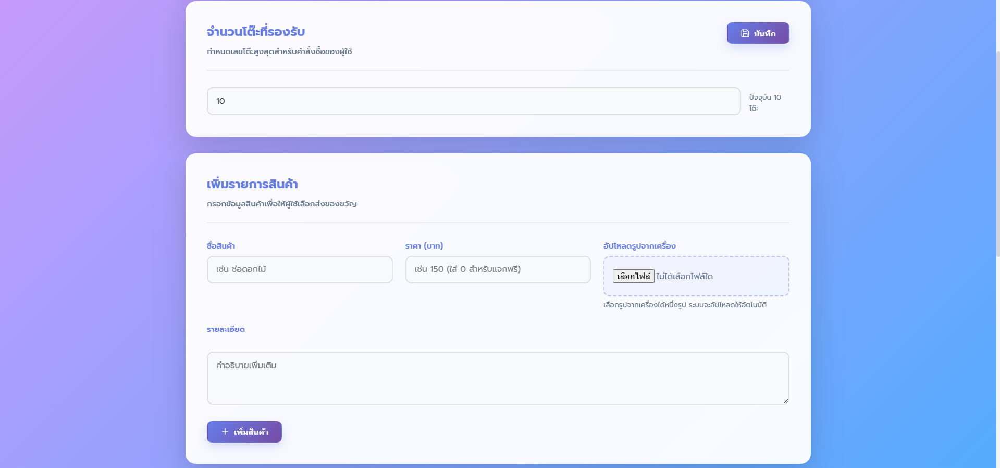
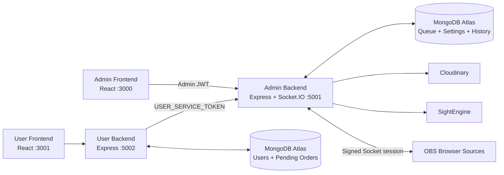

<div align="center">

# CMES-ADMIN

**ระบบจัดการคอนเทนต์และคิวแสดงผลบนจอสำหรับร้านอาหาร บาร์ และสถานบันเทิง — ฝั่งผู้ดูแลร้าน**

[Live Demo](https://cmes-admin-frontend.vercel.app/) · [CMES-USER](https://github.com/66JJN/CMES-USER) · [คู่มือทดลองระบบ](./docs/PILOT_DEMO_RUNBOOK.md)


</div>

## ภาพรวม

CMES-ADMIN เป็นศูนย์ควบคุมของระบบ CMES ผู้ดูแลร้านสามารถเปิด–ปิดบริการ จัดการคิวรูปภาพ ข้อความ ของขวัญ และวันเกิด ตรวจรายการที่ AI flag ควบคุมการเล่นบน OBS ติดตามสถานะคำสั่งซื้อ และดูข้อมูลรายได้หรืออันดับผู้สนับสนุนแยกตามร้านได้แบบ realtime

ระบบออกแบบสำหรับการทดลองใช้งานจริงในสถานบันเทิง โดยให้ MongoDB เป็น source of truth ของคิว ไม่พึ่ง localStorage หรือ memory สำหรับสถานะสำคัญ และมี recovery เมื่อ backend หรือ OBS หลุด

### จุดเด่น

- คิวถาวรใน MongoDB: `pending → approved → playing → completed/rejected`
- Auto queue พร้อม pause, resume, skip, retry และปิดรับคิวใหม่โดยไม่ลบคิวเดิม
- AI moderation สำหรับรูปภาพ: รูปปลอดภัยเข้า approved อัตโนมัติ รูปที่ถูก flag หรือประเมินไม่ได้รอ Admin ตรวจ
- ข้อความเข้า approved อัตโนมัติเพื่อลดภาระพนักงาน
- Free mode บังคับราคา `0` จาก server และไม่ใช้ยอดเงินฟรีกับรายได้/อันดับ
- Admin JWT, Socket authentication, service token และ tenant isolation ตาม `shopId`
- OBS Browser Source สำหรับ Image/Text/Gift, Ranking และ Lucky Wheel
- ศูนย์ควบคุม OBS ผ่านเว็บ พร้อม preview และโปรไฟล์จอแยกได้สูงสุด 8 จอ
- ปรับขนาด ตำแหน่ง การ fit รูป และพื้นหลังการ์ดของ Image/Text/Gift แยกกัน
- Load test 60 submissions ตรวจคิวซ้ำ เพดานต่อผู้ใช้ และไม่ให้เล่นพร้อมกันเกินหนึ่งรายการต่อร้าน

## Screenshots

> รูปในส่วนนี้สามารถแทนที่ด้วยภาพล่าสุดได้โดยใช้ชื่อไฟล์เดิม

<p align="center">
  
</p>

<p align="center">
  
</p>

<p align="center">
  
</p>

## สถาปัตยกรรม



หลักการแยกสิทธิ์:

- Browser ฝั่ง Admin ใช้ JWT ที่ได้จาก `/api/login`
- Browser ฝั่ง User ไม่เรียก privileged Admin API โดยตรง
- User backend เรียก Admin backend ด้วย `USER_SERVICE_TOKEN` ผ่าน header ภายในระหว่าง service
- `shopId` ของคำสั่งที่ต้องยืนยันสิทธิ์มาจาก token/service identity ไม่เชื่อ `x-admin-id` หรือ `x-shop-id` จาก browser เพียงอย่างเดียว
- Socket.IO แยก room ตามร้านและตรวจ token ก่อนเข้าร่วม room

## Queue และการกู้คืน

MongoDB เก็บคิวและสถานะควบคุมหลักทั้งหมด:

| สถานะ | ความหมาย |
|---|---|
| `pending` | รอ AI หรือ Admin ตรวจ |
| `approved` | พร้อมเล่นตามลำดับคิว |
| `playing` | กำลังแสดงบน OBS |
| `completed` | แสดงเสร็จและย้ายไปประวัติ |
| `rejected` | Admin ปฏิเสธและเก็บเหตุผลในประวัติ |

พฤติกรรม recovery:

- Backend restart: รายการที่ค้าง `playing` ถูกคืนเป็น `approved`
- OBS/browser source หลุดเกินช่วงตรวจจับ: ระบบ pause คิวและเก็บรายการเดิมไว้
- OBS กลับมา: โหลดสถานะ `playing`/pause จาก MongoDB และ Admin กด resume หรือ retry ได้
- การส่งซ้ำด้วย `submissionKey` เดิมจะคืนรายการเดิม ไม่สร้างคิวซ้ำ
- จำกัด active queue ต่อผู้ใช้ ค่าเริ่มต้น 3 รายการ ปรับได้ด้วย `MAX_ACTIVE_QUEUE_PER_USER`

### รายได้ อันดับ และประวัติ

- Income และ ranking นับจากรายการที่ชำระเงินสำเร็จ โดยไม่ต้องรอให้ขึ้นจอ
- Check History ใช้รายการปลายทางที่ `completed` หรือ `rejected`; สรุปรายรับของประวัติอ้างอิงรายการที่ชำระแล้วและแสดงเสร็จ
- Free mode คืนยอดเงินและอันดับจากยอดสนับสนุนเป็นศูนย์ พร้อมบังคับราคาแพ็กเกจ/รายการใหม่เป็น `0` ที่ server

## OBS และหลายจอ

หน้า **ศูนย์ควบคุม OBS** ช่วยตั้งค่า Browser Source และควบคุม OBS WebSocket โดยไม่ต้องจัดทุกอย่างใน OBS ด้วยตนเอง

- สร้าง signed display token อายุจำกัดสำหรับ Browser Source
- มี overlay แยกสำหรับ Image/Text/Gift, Ranking และ Lucky Wheel
- ตั้งโปรไฟล์จอได้สูงสุด 8 จอ พร้อมชื่อ ความละเอียด และเปิด/ปิดแต่ละจอ
- แต่ละโปรไฟล์ปรับ preset, image fit, ตำแหน่งแนวตั้ง, card scale, ความกว้างรูป และ text scale
- พื้นหลังการ์ด Image, Text และ Gift ตั้งแยกเป็นโปร่งใส, มืดโปร่ง หรือเบลอได้
- การเชื่อม OBS WebSocket คงอยู่แม้ปิด modal และตัดเมื่อผู้ใช้กดตัดการเชื่อมต่อหรือออกจาก dashboard
- Overlay แสดง fallback “ระบบกำลังเชื่อมต่อ” เมื่อ realtime ขาดหาย

### ทดสอบ OBS โดยไม่ส่งรายการจริง

ในหน้า **ศูนย์ควบคุม OBS** ผู้ดูแลสามารถกดทดสอบเพื่อเล่นข้อมูลจำลองตามลำดับ **รูปภาพพร้อมข้อความ → ข้อความล้วน → ของขวัญ** ผ่านคิวและ Browser Source ชุดเดียวกับงานจริง

1. เปิด OBS Browser Source และรอให้สถานะแสดงว่าเชื่อมต่อแล้ว
2. ตรวจให้แน่ใจว่าไม่มีรายการ `pending`, `approved` หรือ `playing` ค้างอยู่
3. กด **เริ่มทดสอบ OBS** และยืนยันการทดสอบ
4. ตรวจทั้งสามรูปแบบบนจอ; แต่ละรายการแสดง 15 วินาทีและเว้น 1 วินาที รวมประมาณ 47 วินาที
5. หากต้องการยุติก่อนจบ ให้กด **หยุดทดสอบและล้างข้อมูล**

ระหว่างทดสอบ server จะปิดรับรายการใหม่ชั่วคราว แล้วคืนค่าการรับคิวเดิมเมื่อจบ ข้อมูลจำลองจะไม่ถูกนำไปนับในประวัติลูกค้า รายได้ อันดับ การชำระเงิน หรือโควตาคิว หากล้างข้อมูลไม่สำเร็จ ระบบจะยังปิดรับรายการใหม่ไว้และแสดงปุ่มให้ลองล้างอีกครั้ง เพื่อไม่ให้ข้อมูลทดสอบปะปนกับงานจริง

> OBS WebSocket ปกติใช้ `ws://localhost:4455` และเข้าถึงได้จาก browser ที่อยู่เครื่องหรือเครือข่ายเดียวกับ OBS เท่านั้น

## Tech Stack

| ส่วน | เทคโนโลยี |
|---|---|
| Frontend | React 19, React Router 7, CSS design system, Socket.IO Client, obs-websocket-js |
| Backend | Node.js, Express 4, Socket.IO 4, ES Modules |
| Database | MongoDB Atlas, Mongoose 9 |
| Authentication | JWT, bcrypt, server-to-server service token |
| Storage | Cloudinary |
| Moderation | SightEngine |
| Operations | Helmet, CORS allowlist, rate limiting, Mongo sanitization, node-cron |
| Deployment | Vercel frontend, Render backend |

## Local services

ห้ามเปลี่ยนพอร์ตระหว่างสองโปรเจกต์ เพราะ CORS, Socket.IO และ service URL อ้างอิงชุดนี้ร่วมกัน:

| Service | URL |
|---|---|
| CMES-ADMIN frontend | `http://localhost:3000` |
| CMES-ADMIN backend | `http://localhost:5001` |
| CMES-USER frontend | `http://localhost:3001` |
| CMES-USER backend | `http://localhost:5002` |

## Quick Start

### Requirements

- Node.js 20+
- npm
- MongoDB Atlas
- Cloudinary
- CMES-USER สำหรับทดสอบ customer flow แบบครบระบบ
- SightEngine เฉพาะเมื่อต้องการ AI moderation
- OBS Studio 28+ เฉพาะเมื่อต้องการทดสอบจอจริง

### ติดตั้ง

```powershell
git clone https://github.com/66JJN/CMES-ADMIN.git
cd CMES-ADMIN

cd backend
Copy-Item .env.example .env
npm install

cd ../frontend
Copy-Item .env.example .env
npm install
```

ใส่ค่าจริงใน `.env` ของ backend/frontend โดยไม่ commit ไฟล์ดังกล่าว

### เปิดระบบ local

```powershell
# Terminal 1 — Admin backend :5001
cd D:\CMES-ADMIN\backend
npm run dev

# Terminal 2 — Admin frontend :3000
cd D:\CMES-ADMIN\frontend
npm start
```

เปิด `http://localhost:3000`

## Environment Variables

ดูรายการครบและค่าตัวอย่างได้ที่ [backend/.env.example](./backend/.env.example) และ [frontend/.env.example](./frontend/.env.example)

### Admin backend

| Variable | หน้าที่ | Required |
|---|---|---|
| `MONGODB_URI` | MongoDB connection ของข้อมูล Admin/Queue | Yes |
| `ADMIN_JWT_SECRET` | เซ็น Admin JWT; ต้องคงที่ระหว่าง deploy | Yes |
| `USER_SERVICE_TOKEN` | ยืนยัน User backend; ต้องตรงกับ CMES-USER backend | Yes |
| `USER_FRONTEND_URL` | CORS allowlist ของ User frontend | Yes |
| `ADMIN_FRONTEND_URL` | CORS allowlist ของ Admin frontend | Yes |
| `CLOUDINARY_CLOUD_NAME` | Cloudinary account | Yes |
| `CLOUDINARY_API_KEY` | Cloudinary API key | Yes |
| `CLOUDINARY_API_SECRET` | Cloudinary API secret | Yes |
| `SIGHTENGINE_API_USER` | AI moderation user | Optional |
| `SIGHTENGINE_API_SECRET` | AI moderation secret | Optional |
| `MAX_ACTIVE_QUEUE_PER_USER` | จำนวน active queue ต่อผู้ใช้; default `3` | Optional |
| `ADMIN_JWT_EXPIRES_IN` | อายุ Admin JWT; default `8h` | Optional |
| `OBS_JWT_EXPIRES_IN` | อายุ display token; default `24h` | Optional |
| `PORT` | Admin backend port; default `5001` | Optional |

`ADMIN_JWT_SECRET` และ `USER_SERVICE_TOKEN` ทำคนละหน้าที่และควรเป็นคนละค่า ห้ามส่งตัวแปรใดไปยัง frontend

### Admin frontend

| Variable | Local value |
|---|---|
| `REACT_APP_API_URL` | `http://localhost:5001` |
| `REACT_APP_USER_API_URL` | `http://localhost:5002` |
| `REACT_APP_USER_FRONTEND_URL` | `http://localhost:3001` |

Socket.IO ใช้ backend เดียวกับ `REACT_APP_API_URL` ในโค้ดปัจจุบัน

## API สำคัญ

Endpoint ด้านล่างเป็นเพียงภาพรวม โปรดดู `backend/routes/` สำหรับรายการทั้งหมด

| Method | Endpoint | สิทธิ์ | หน้าที่ |
|---|---|---|---|
| `POST` | `/login` | Public | Login และออก Admin JWT |
| `GET` | `/health` | Public | Health check และสถานะ MongoDB |
| `POST` | `/api/config/update` | Admin | บันทึก system/free/overlay config |
| `GET` | `/api/queue` | Admin | อ่านคิวของร้าน |
| `POST` | `/api/queue/pause` | Admin | หยุดเวลาและการเล่นคิว |
| `POST` | `/api/queue/resume` | Admin | เล่นคิวต่อจากเวลาที่เหลือ |
| `POST` | `/api/queue/retry` | Admin | คืนงานที่สะดุดกลับเข้า approved |
| `POST` | `/api/complete/:id` | Admin | ข้าม/จบรายการปัจจุบัน |
| `GET` | `/api/obs-test/status` | Admin | ตรวจความพร้อมและสถานะการทดสอบ OBS |
| `POST` | `/api/obs-test/start` | Admin | เริ่มเล่นข้อมูลจำลองทั้งสามรูปแบบ |
| `POST` | `/api/obs-test/stop` | Admin | หยุดและล้างข้อมูลของรอบทดสอบ |
| `POST` | `/api/history/restore/:id` | Admin | ดึงประวัติกลับเข้าคิวใหม่ |
| `POST` | `/api/upload` | User service | รับ content จาก CMES-USER backend |
| `POST` | `/api/queue/eligibility` | User service | ตรวจเพดานคิวก่อนรับชำระเงิน |
| `GET` | `/api/order-status/:orderId` | User service | สถานะรายการสำหรับ User backend |
| `GET` | `/api/obs/display-token` | Admin | สร้าง signed token สำหรับ OBS |

## การทดสอบ

### Frontend build

```powershell
cd frontend
npm run build
```

### Queue load test

ใช้ MongoDB test/local ที่ไม่มีข้อมูลสำคัญ สคริปต์สร้าง shop ชั่วคราวและล้างข้อมูลของ test shop ใน `finally`

```powershell
cd backend
npm run test:queue-load
```

ผลที่คาดหวัง:

```text
PASS: 60 concurrent submissions; no duplicate; cap enforced; queue recovered and advanced.
```

Load test นี้ตรวจ logic 60 submissions ไม่ใช่การรับรอง production capacity ของ Render หรือเครือข่ายร้าน ควรทดสอบ Wi‑Fi, OBS และ backend จริงก่อนวันใช้งาน

## Pilot checklist

- `/health` ตอบ 200 และ MongoDB connected
- User ส่ง Image, Text, Gift และ Birthday ตามโหมดที่เปิดได้
- การกดซ้ำ/เน็ตสะดุดไม่สร้างรายการซ้ำ
- pause/resume ทำให้เวลาหยุดและเดินต่อถูกต้องทั้ง Admin และ OBS
- ปิด OBS แล้วคิวไม่หาย; เปิดกลับแล้ว retry/resume ได้
- restart backend แล้วรายการ approved ยังอยู่
- ปิดรับคิวใหม่แล้วคิวเดิมไม่ถูกลบ
- Free mode แสดงราคา 0 จากข้อมูล server
- ตรวจ OBS Browser Source ทุกโปรไฟล์จอ
- รัน queue load test ผ่านด้วย environment ที่จะใช้จริง

ดูขั้นตอน demo เพิ่มเติมที่ [docs/PILOT_DEMO_RUNBOOK.md](./docs/PILOT_DEMO_RUNBOOK.md)

## Deployment

### Backend — Render

1. Root Directory: `backend`
2. Build Command: `npm install`
3. Start Command: `npm start`
4. ตั้ง environment จาก `backend/.env.example`
5. ตั้ง `ADMIN_FRONTEND_URL` และ `USER_FRONTEND_URL` เป็น production URL จริง
6. ตั้ง `USER_SERVICE_TOKEN` ค่าเดียวกับ CMES-USER backend

### Frontend — Vercel

1. Root Directory: `frontend`
2. Build Command: `npm run build`
3. ตั้ง `REACT_APP_API_URL`, `REACT_APP_USER_API_URL` และ `REACT_APP_USER_FRONTEND_URL`
4. Deploy ใหม่เมื่อเปลี่ยนตัวแปร `REACT_APP_*` เพราะค่าถูกฝังตอน build

## Troubleshooting

| อาการ | สาเหตุ/วิธีตรวจ |
|---|---|
| `Invalid or expired socket session` | Admin JWT หมดอายุหรือ `ADMIN_JWT_SECRET` เปลี่ยน ให้ login ใหม่และใช้ secret คงที่บน Render |
| `Not allowed by CORS` | URL frontend ไม่ตรง `ADMIN_FRONTEND_URL`/`USER_FRONTEND_URL` รวมถึงพอร์ต |
| `EADDRINUSE :5001` | มี Admin backend เปิดอยู่แล้ว ตรวจ process ก่อนเปิดซ้ำ |
| MongoDB SRV resolve ไม่ได้ | ตรวจ `nslookup -type=SRV _mongodb._tcp.<cluster>` และ network access ของ Atlas |
| OBS แสดง “ระบบกำลังเชื่อมต่อ” | ตรวจ signed token, Browser Source URL, backend และ Socket.IO |
| เปิดเว็บได้แต่สวิตช์ไม่บันทึก | ตรวจ Network ของ `/api/config/update`; 401 หมายถึงต้อง login ใหม่ |

## Project Structure

```text
CMES-ADMIN/
├── backend/
│   ├── controllers/       # Queue, config, ranking, gifts, reports, OBS
│   ├── middleware/        # JWT/service/display auth, rate limits
│   ├── models/            # Queue, history, settings, ranking, admin
│   ├── routes/            # Express route modules
│   ├── services/          # Queue worker, recovery, submissions
│   ├── public/            # OBS browser-source overlays
│   ├── scripts/           # Load test and migrations
│   └── server.js
├── frontend/
│   └── src/
│       ├── components/    # Dashboard and reusable UI
│       ├── contexts/      # Shop and dashboard state
│       ├── hooks/         # Queue, realtime, OBS and data logic
│       ├── pages/         # Login, Home, Queue, Profile, OBS
│       └── config/        # API and authenticated fetch
├── docs/
└── README.md
```

## Related repository

[CMES-USER](https://github.com/66JJN/CMES-USER) — เว็บสำหรับลูกค้าสมัครสมาชิก เลือกบริการ ส่งคอนเทนต์ ชำระเงิน และติดตามสถานะ

## License

ISC License

<div align="center">
Built by <a href="https://github.com/66JJN">SUPHAKON SAEPHAN</a>
</div>
